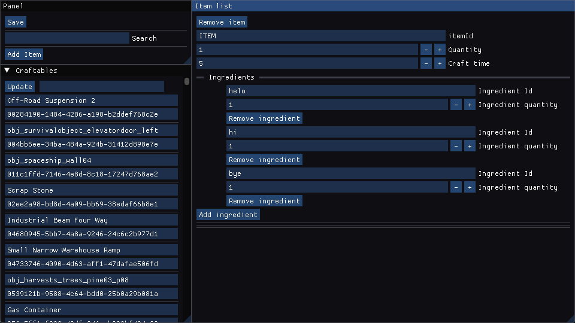

# Better Craft Bot Recipe Creator

This program is a better version of [my old program written in C#](https://github.com/IsaacDeve/ScrapMechanic-CraftBotRecipeCreator).

It is better in many ways, it is fully rewritten in C++, thanks to which it works much faster.
It is more convenient due to new intuitive ImGui interface 

# How to use

Drag & Drop your .json recipe into the program

